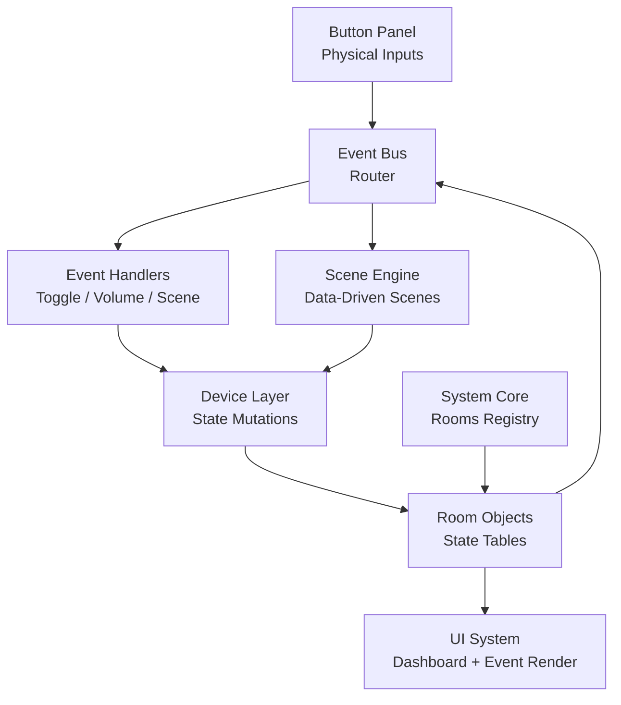
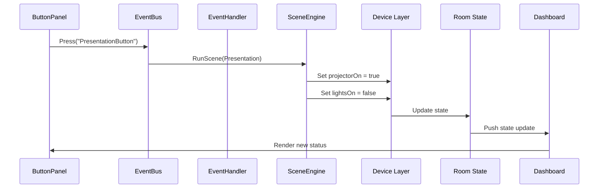
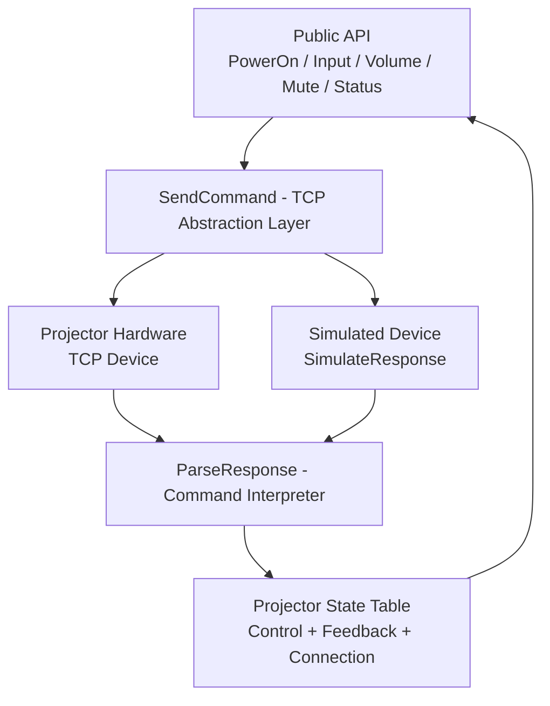
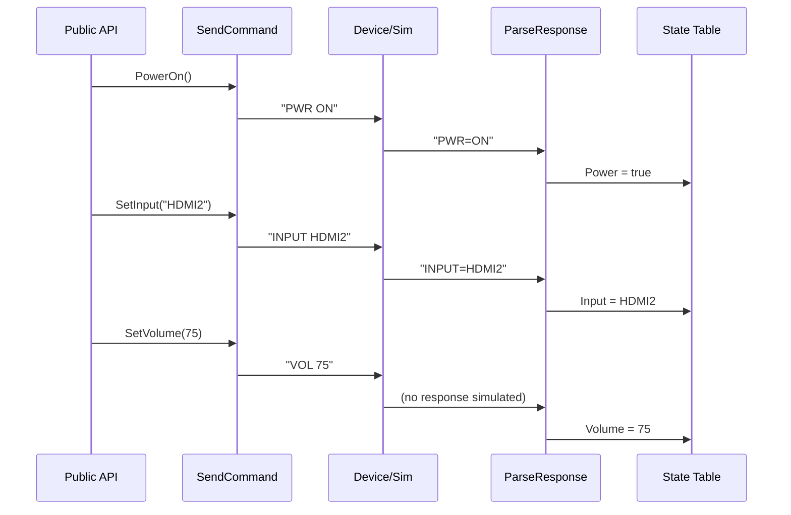

# Q-SYS Lua Learning

This new repository documents my learning journey with Lua programming and AV control system development, with a focus on Q-SYS-style control logic and device driver architecture.

---

## Structure

### Basics
Fundamental Lua concepts and small exercises, including:
- Variables and data types
- Tables and data structures
- Functions
- Control flow (if/loops)
- Event-driven patterns

##

### Projects

#### AV Control System
A simulated AV control system designed to practice:
- Lua tables for state management
- Function-based control logic
- Event-driven programming concepts
- System state modeling

## AV Control System Architecture

---

## AV System Event Flow (How the System Works)

The diagram below shows how a button press travels through the system:

1. A physical button is pressed in the Button Panel  
2. The Event Bus receives and routes the event  
3. Either an Event Handler or Scene Engine processes it  
4. The Device Layer updates the room state  
5. The UI refreshes to reflect the new system status 

---

#### TCP Socket Projector Driver
A simulated projector driver focused on control system architecture:
- Driver structure and design patterns
- Command parsing and formatting
- Device feedback handling
- State tracking via tables
- Concepts of TCP-based communication

## Projector Driver 

---

## Projector Command + Response Flow (TCP Simulation)

This diagram shows how a command travels through the simulated TCP driver:

1. A public API function is called (PowerOn, Input, Volume, etc.)  
2. The command is sent through SendCommand (TCP layer)  
3. The device (or simulation layer) responds  
4. ParseResponse interprets the message  
5. The internal state table is updated 

## Planned enhancements:
- Q-SYS `TcpSocket.New()` integration concepts
- Event handlers and callbacks
- Polling mechanisms
- Auto-reconnect logic
- Production-style driver architecture

---

##  Learning Goals

- Build real-world AV control logic using Lua
- Understand driver architecture patterns
- Model device state reliably
- Transition from scripts → structured control systems

---

##  License & Usage

© 2026 Douglas Moth - Bells & Whistles Designs. All rights reserved.

This repository is provided for portfolio and evaluation purposes only.

No permission is granted to use, copy, modify, or distribute this code
without explicit written consent from the author.